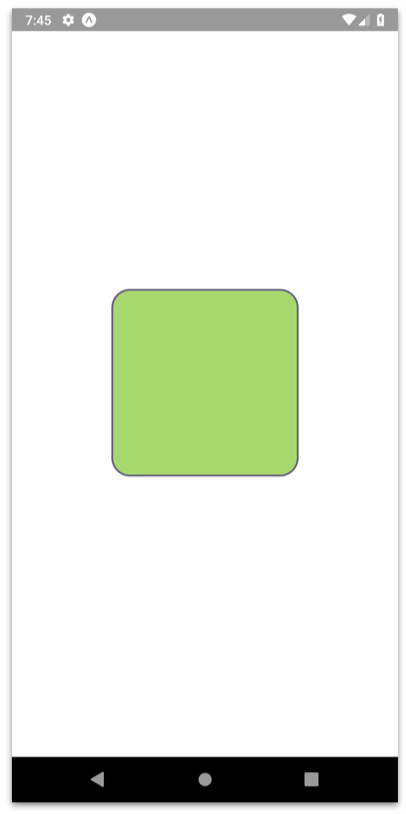
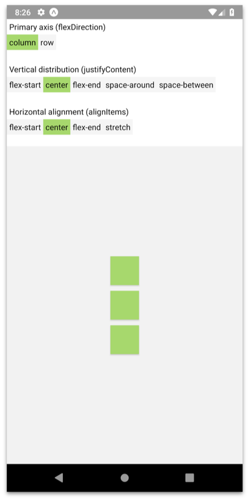
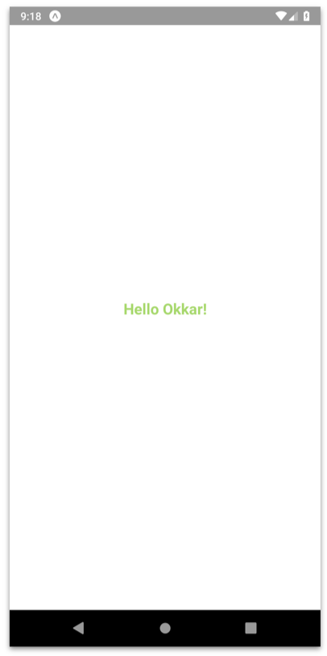
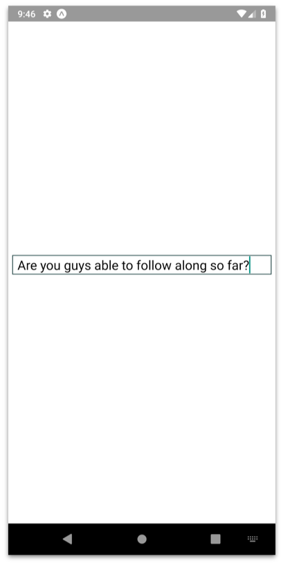
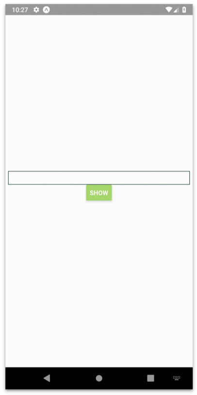
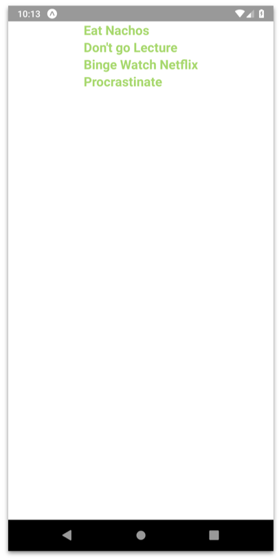
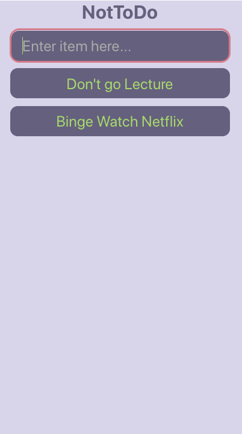

# Baby Steps into React Native

Learning new technology can be _daunting_. When I first started learning about React Native I dove right into it. Started off by reading documentations which was _time-consuming_.

In this workshop, we are going to learn about React Native's Core Components which will allow you to create an application at the end using _'Baby Steps'_ approach. Taking one step at a time towards our final application. All within 2 hours.

With this, I hope to _reduce friction_ at the start of your React Native learning journey.

To see the full content [click here](https://docs.google.com/presentation/d/1fU4m2T_tet1QC1aElA0NELYSU6IUVbvSaA8FQ64QAjA/edit?usp=sharing)

---

## JavaScript refresher

Before we continue, let us take a look at bascic JavaScript required for our _Baby Steps_

### Variables

#### Declaration

Do use `const` and `let` for variables. Do not use `var`

```js
const count = 10

for (let i=0, i<count; i++) {
  console.log(`Hello ${count}`)
}
// 0, 1, 2, 3, ..., 9
```

#### String interpolation

Variables can be used in multiple combination with strings. Below are two most common way

Notice the use of `backtick` with `${...}`

```js
const name = 'Okkar'

console.log('Hello ' + name)
console.log(`Hello ${name}`)
// Hello Okkar
```

### Equality

When checking for equality in JavaScript, it is recommended to use three equals `===`

```js
const a = 1 // integer
const b = '1' // string
const c = 1 // integer

console.log(a == b) // true
console.log(a === b) // false
console.log(a === c) // true
```

### Data Structures

#### Array

```js
const anArray = ['o', 'k', 'k', 'a', 'r']

console.log(anArray[1]) // k
```

#### Object

```js
const object = {
  // key : value
  a: 1,
  b: 'Okkar'
}

console.log(object.b) // Okkar
```

#### Nested Object

```js
const nestedObject = {
  a: 1,
  b: 'Okkar',
  c: {
    d: 'Min',
    e: 25
  }
}
```

`c` is a key which contains the value of another object `{d: "Min", e: 25}`

### Functions

Two common way to declare functions, prefers arrow function over traditional function

```js
// traditional
function say(name) {
  console.log(`Hello ${name}`)
}

// arrow
const say = name => {
  console.log(`Hello ${name}`)
}

say('Okkar Min') // Hello Okkar Min
```

### Spreading

This is a little bit tricky, but you can do it!

```js
const numbers = [1, 2, 3]
const twice = [...numbers, ...numbers] // [1,2,3,1,2,3]

const letters = ['x', 'y', 'z']
const thrice = [...numbers, ...letters, ...numbers]
// [1,2,3,'x','y','z',1,2,3]
```

Spreading : takes an iterable and give out elements in iterable

### De-structuring

Another tricky fellow

```js
const user = {
  studentID: 'OMIN001',
  fullName: {
    firstName: 'Okkar',
    lastName: 'Min'
  }
}

// OMIN001
let studentID = user.studentID
console.log(studentID)

let { studentID } = user
console.log(studentID)

// Okkar Min
let firstName = user.fullName.firstName
let lastName = user.fullName.lastName
console.log(firstName + ' ' + lastName)

let { firstName, lastName } = user.fullName
console.log(`${firstName} ${lastName}`)
```

---

## React Native Core Components

- [View](#view)
- [FlexBox](#flexbox)
- [Text](#text)
- [TextInput](#textinput)
- [Button](#button)
- [FlatList](#flatlist)

### View

<p align="center">
  
</p>

```js
import React from 'react'
import { StyleSheet, Text, View } from 'react-native'

export default function App() {
  return (
    <View style={styles.container}>
      <View style={styles.box} />
    </View>
  )
}

const styles = StyleSheet.create({
  container: {
    flex: 1,
    justifyContent: 'center',
    alignItems: 'center'
  },
  box: {
    width: 200,
    height: 200,
    backgroundColor: '#A7D86D',
    borderWidth: 2,
    borderColor: 'darkslategrey',
    borderRadius: 20
  }
})
```

### FlexBox

<p align="center">
  
</p>

```js
import React, { Component } from 'react'
import { View, Text, TouchableOpacity, StyleSheet } from 'react-native'

export class Toggle extends Component {
  onPress = option => {
    const { onChange } = this.props

    onChange(option)
  }

  renderOption = (option, i) => {
    const { value } = this.props

    return (
      <TouchableOpacity
        style={[styles.option, option === value && styles.activeOption]}
        onPress={this.onPress.bind(this, option)}
        key={i}
      >
        <Text style={styles.text}>{option}</Text>
      </TouchableOpacity>
    )
  }

  render() {
    const { label, options } = this.props

    return (
      <View style={styles.container}>
        <Text style={[styles.text, styles.label]}>{label}</Text>
        <View style={styles.optionsContainer}>
          {options.map(this.renderOption)}
        </View>
      </View>
    )
  }
}

export default class App extends Component {
  state = {
    flexDirection: 'column',
    justifyContent: 'center',
    alignItems: 'center'
  }

  render() {
    const { flexDirection, alignItems, justifyContent } = this.state
    const layoutStyle = { flexDirection, justifyContent, alignItems }

    const primaryAxis = flexDirection === 'row' ? 'Horizontal' : 'Vertical'
    const secondaryAxis = flexDirection === 'row' ? 'Vertical' : 'Horizontal'

    return (
      <View style={styles.container1}>
        <Toggle
          label={'Primary axis (flexDirection)'}
          value={flexDirection}
          options={['column', 'row']}
          onChange={option => this.setState({ flexDirection: option })}
        />
        <Toggle
          label={primaryAxis + ' distribution (justifyContent)'}
          value={justifyContent}
          options={[
            'flex-start',
            'center',
            'flex-end',
            'space-around',
            'space-between'
          ]}
          onChange={option => this.setState({ justifyContent: option })}
        />
        <Toggle
          label={secondaryAxis + ' alignment (alignItems)'}
          value={alignItems}
          options={['flex-start', 'center', 'flex-end', 'stretch']}
          onChange={option => this.setState({ alignItems: option })}
        />
        <View style={[styles.layout, layoutStyle]}>
          <View style={styles.box} />
          <View style={styles.box} />
          <View style={styles.box} />
        </View>
      </View>
    )
  }
}

const styles = StyleSheet.create({
  container: {
    flexDirection: 'column',
    paddingBottom: 20
  },
  container1: {
    flex: 1
  },
  text: {
    fontSize: 14
  },
  label: {
    padding: 4
  },
  optionsContainer: {
    flexDirection: 'row',
    flexWrap: 'wrap'
  },
  option: {
    padding: 4,
    backgroundColor: 'whitesmoke'
  },
  activeOption: {
    backgroundColor: '#A7D86D'
  },
  layout: {
    flex: 1,
    backgroundColor: 'rgba(0,0,0,0.05)'
  },
  box: {
    padding: 25,
    backgroundColor: '#A7D86D',
    margin: 5
  }
})
```

### Text

<p align="center">
  
</p>

```js
import React from 'react'
import { StyleSheet, Text, View } from 'react-native'

function App() {
  return (
    <View style={styles.container}>
      <Text style={styles.greetings}>Hello Okkar!</Text>
    </View>
  )
}

const styles = StyleSheet.create({
  container: {
    flex: 1,
    justifyContent: 'center',
    alignItems: 'center'
  },
  greetings: {
    fontSize: 20,
    fontWeight: 'bold',
    color: '#A7D86D'
  }
})
export default App
```

### TextInput

<p align="center">
  
</p>

```js
import React from 'react'
import { StyleSheet, TextInput, View } from 'react-native'

export default class App extends React.Component {
  state = {
    text: ''
  }

  render() {
    return (
      <View style={styles.container}>
        <TextInput
          style={styles.textInput}
          onChangeText={text => this.setState({ text })}
          value={this.state.text}
        />
      </View>
    )
  }
}

const styles = StyleSheet.create({
  container: {
    flex: 1,
    justifyContent: 'center',
    alignItems: 'center'
  },
  textInput: {
    width: 400,
    fontSize: 20,
    borderColor: 'darkslategrey',
    borderWidth: 1,
    paddingHorizontal: '2%'
  }
})
```

### Button

<p align="center">
  
</p>

```js
import React from 'react'
import { View, Button } from 'react-native'

const App = () => {
  return (
    <View style={{ flex: 1, justifyContent: 'center', alignItems: 'center' }}>
      <Button
        onPress={() => alert('Button Pressed')}
        title="Show"
        color="#A7D86D"
      />
    </View>
  )
}
export default App
```

### FlatList

<p align="center">
  
</p>

```js
import React from 'react'
import {
  View,
  Text,
  FlatList,
  StyleSheet,
  StatusBar,
  SafeAreaView
} from 'react-native'

export default class App extends React.Component {
  render() {
    return (
      <View style={styles.container}>
        <SafeAreaView />
        <FlatList
          data={[
            { key: 'Eat Nachos' },
            { key: "Don't go Lecture" },
            { key: 'Binge Watch Netflix' },
            { key: 'Procrastinate' }
          ]}
          renderItem={({ item }) => <Text style={styles.text}>{item.key}</Text>}
        />
      </View>
    )
  }
}

const styles = StyleSheet.create({
  container: {
    flex: 1,
    alignItems: 'center',
    marginTop: StatusBar.currentHeight
  },
  text: {
    fontSize: 20,
    fontWeight: 'bold',
    color: '#A7D86D'
  }
})
```

---

## Combining the 6 Core Concepts

<p align="center">
  
</p>

```js
import React from 'react'
import {
  View,
  Text,
  TextInput,
  Button,
  StyleSheet,
  SafeAreaView,
  FlatList,
  TouchableOpacity
} from 'react-native'

const theme = {
  green: '#A7D86D',
  lightPurple: '#D8D5EB',
  darkPurple: '#65607D'
}

export default class App extends React.Component {
  state = {
    text: '',
    data: [{ key: "Don't go Lecture" }, { key: 'Binge Watch Netflix' }]
  }

  render() {
    return (
      <View style={styles.mainBackground}>
        <SafeAreaView />

        <Text style={styles.title}>NotToDo</Text>

        <TextInput
          style={styles.textInput}
          onChangeText={text => this.setState({ text })}
          onSubmitEditing={() =>
            this.setState({
              data: [{ key: this.state.text }, ...this.state.data],
              text: ''
            })
          }
          value={this.state.text}
          placeholder="Enter item here..."
        />

        <FlatList
          data={this.state.data}
          style={styles.flatList}
          renderItem={({ item }) => (
            <TouchableOpacity
              onPress={() =>
                this.setState({
                  data: this.state.data.filter(
                    individualData => individualData.key != item.key
                  )
                })
              }
            >
              <View style={styles.itemContainer}>
                <Text style={styles.itemText}>{item.key}</Text>
              </View>
            </TouchableOpacity>
          )}
        />
      </View>
    )
  }
}

const styles = StyleSheet.create({
  mainBackground: {
    flex: 1,
    paddingHorizontal: '5%',
    backgroundColor: theme.lightPurple
  },
  title: {
    fontSize: 25,
    fontWeight: 'bold',
    textAlign: 'center',
    color: theme.darkPurple,
    marginBottom: 10
  },
  textInput: {
    height: 40,
    fontSize: 20,
    borderRadius: 10,
    marginBottom: 10,
    color: theme.green,
    paddingHorizontal: '5%',
    backgroundColor: theme.darkPurple
  },
  flatList: {
    flex: 1
  },
  itemContainer: {
    justifyContent: 'center',
    alignItems: 'center',
    height: 40,
    borderRadius: 10,
    marginBottom: 10,
    backgroundColor: theme.darkPurple,
    paddingHorizontal: '5%'
  },
  itemText: {
    fontSize: 20,
    color: theme.green
  }
})
```
